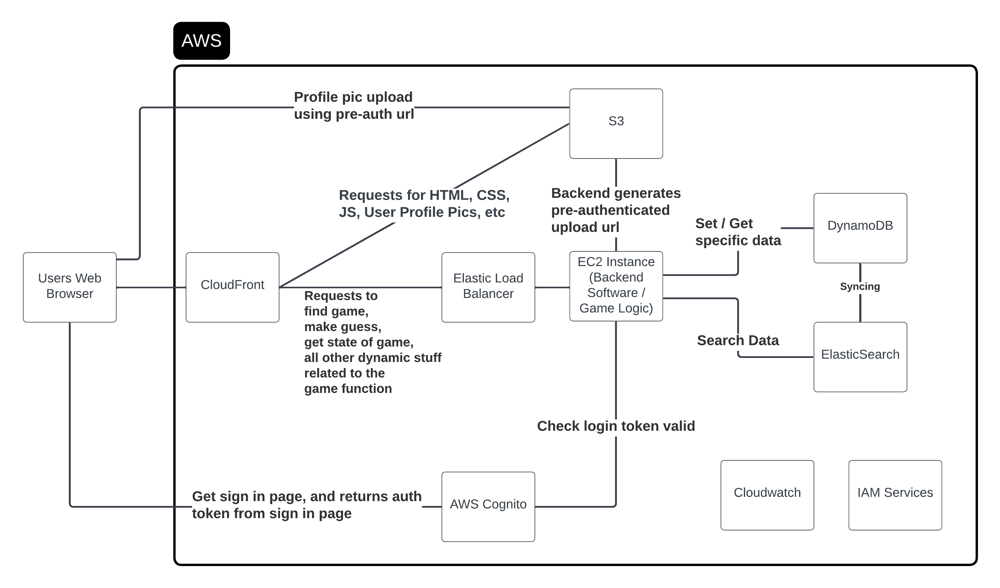

Plan

Data Engineer
 - DynamoDb
 - ElasticSearch

Tester
 - Testing
 - S3, create a static bucket to hold html, css, js provided by the frontend engineer and a second bucket to hold user profile pics
 - Cloudfront, connect to the created S3 buckets, forward any other non-s3 requests to elastic load balancer

DevOps Engineer
 - Elastic Load Balancer
 - EC2

AWS Integration Engineer
 - Cloudwatch
 - IAM Services
 - Cognito, setup hosted ui, give redirect url to frontend

Frontend
 - React
 - Leaflet (Experimentation demo done by jayden in backend jsn file)
 - Redirect user to cognito hosted ui

BackEnd
 - Flask
 - Python
